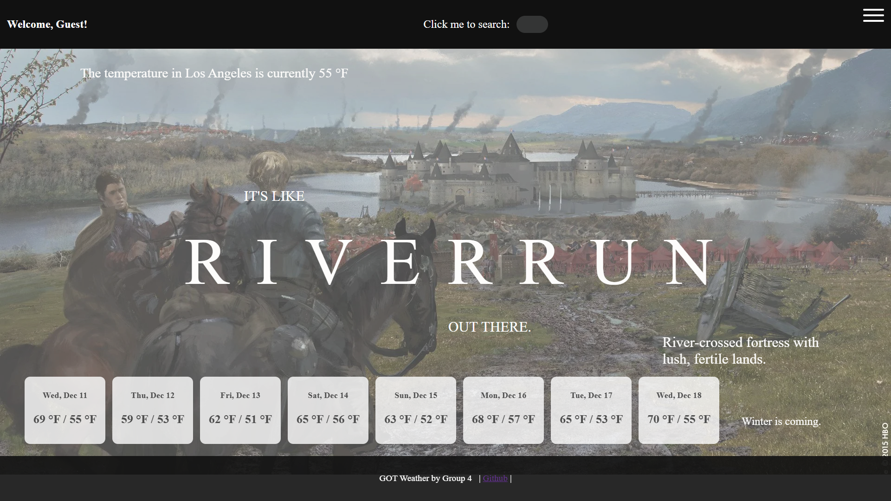

# GOT Weather

Originally forked from Star Wars Weather, GOT weather takes a game of thrones inspired twist that depends on your City's Weather.
You can save your favorite location, search by City Name, and have different forecasts formats available.

### Sample Images:

Fairly Pleasant?


### Installation

You will need MariaDB and the Node package manager to install GOT weather.
You will also need Angular and Express to install GOT weather.

```bash
sudo apt update
sudo apt install mariadb-server
sudo apt install nodejs
npm install -g @angular/cli
npm install express
```

Ensure that MariaDB service is running then run create_got_weather_db.sql in database directory

```bash
cd ./seniordesign-weather/database/
mysql -u <username> -p < create_got_weather_db.sql
```

Run the server.js file in backend directory

```bash
cd ./seniordesign-weather/backend/
npm install
node server.js
```

run ng serve in got-weather-app directory

```bash
cd ./got-weather-app
ng serve
```

### Resources

- [OpenWeather API](https://openweathermap.org/)
- Inspiration by Tom Scott's Star Wars Weather that [closed down](https://www.tomscott.com/weather/starwars/)

### If Cloning

- Generate your own API key at [OpenWeatherAPI](https://openweathermap.org/api)
- Change the apiKey in the weather.component.ts to your own API key

```
    private readonly apiKey = 'Replace text with your key here with quotes';

```

- Project should be up and running!
